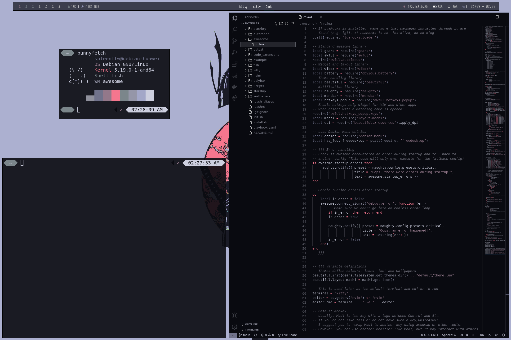
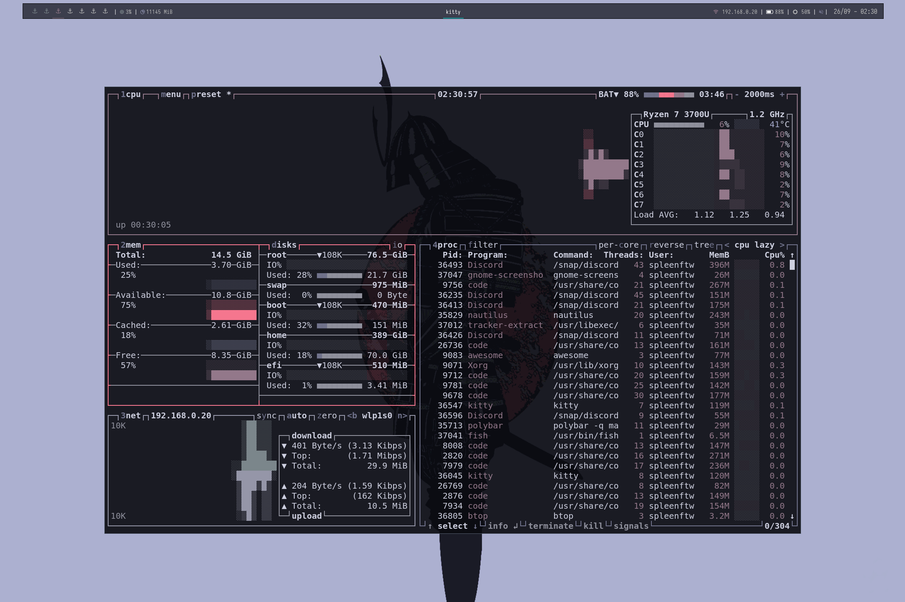
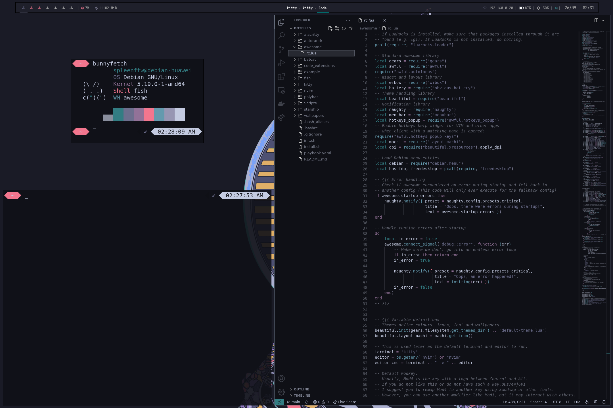
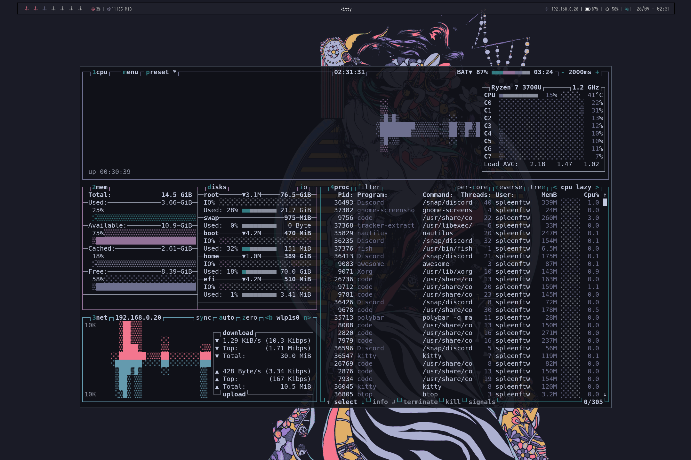

# Spleenftw's dotfiles


### Currently supports the following confs :
- [autorandr](https://github.com/phillipberndt/autorandr) 
- [awesome](https://github.com/awesomeWM/awesome) (awesome v4.3)

    ↳ [layout-machi](https://github.com/xinhaoyuan/layout-machi)
- [batcat](https://github.com/sharkdp/bat) (bat 0.19.0)
- [fish](https://github.com/fish-shell/fish-shell) (fish, version 3.3.1)
  
    ↳ [prompt 1 : tide](https://github.com/IlanCosman/tide) (tide, version 5.5.1)

    ↳ [prompt 2 : starship](https://github.com/starship/starship) (starship 1.3.0)
- [kitty](https://sw.kovidgoyal.net/kitty/) (kitty 0.21.2)
- [nvim](https://github.com/neovim/neovim) (NVIM v0.6.1)
- [polybar](https://github.com/polybar/polybar) (polybar 3.5.7)

  
### Many thanks to the following people and their work :


- [bunnyfetch](https://github.com/Rosettea/bunnyfetch)
- [eugene-caffeine](https://github.com/eugenecormier/eugene-caffeine)
- [nautilus-open-any-terminal](https://github.com/Stunkymonkey/nautilus-open-any-terminal)
- [pokemon-colorscripts](https://gitlab.com/phoneybadger/pokemon-colorscripts)
- [pywal](https://github.com/sonjiku/pywal)
- [ripgrep](https://github.com/BurntSushi/ripgrep)
- [rofi-bluetooth](https://github.com/nickclyde/rofi-bluetooth)
- [slock-blur](https://github.com/aario/slock-blur)
- [Wal-theme-vscode-extension](https://marketplace.visualstudio.com/items?itemName=dlasagno.wal-theme)


# Awesomewm rice example


https://user-images.githubusercontent.com/57947900/192268639-b611776d-cbf9-4678-9827-d8592836aa2b.mp4






# Installation 
## Requirements 

- git 
- sudo access

CLI : 

```
mkdir $HOME/Github
cd $HOME/Github
git clone https://github.com/spleenftw/dotfiles
cd dotfiles
chmod +x install.sh
./install.sh
```

Then simply log-out and choose awesomewm as windows manager when you're logging in.

# Basic deployement with Ansible
## Requirements
- git
- sudo access

``/!\ Don't forget to change the user name with yours in the playbook.yaml /!\``

CLI 
```
mkdir $HOME/Github
git clone https://github.com/spleenftw/dotfiles
cd dotfiles
chmod+x init.sh
./init.sh
```


# Other files 
You can find the screenshots used before in the [/example](https://github.com/Spleenftw/dotfiles/tree/main/example) folder.

You can find all of the wallpapers i'm using in the [wallpapers](https://github.com/Spleenftw/wallpapers) repository. I've put all the wallpapers i'm using into the [wallpapers/originalres](https://github.com/Spleenftw/wallpapers/tree/main/originalres) folder and resized them to [1920x1080](https://github.com/Spleenftw/wallpapers/tree/main/1920x1080) & [2160x1440](https://github.com/Spleenftw/wallpapers/tree/main/2160x1440). 


# Todo list

- [x] Adding the kitty install to the install.sh & playbook.yml files.
- [x] Adding the font&icon install to the playbook.yml file.
- [x] Adding the fish plugins install to the install.sh & playbook.yml files.
- [x] Adding the starship prompt install to the install.sh & playbook.yml files.
